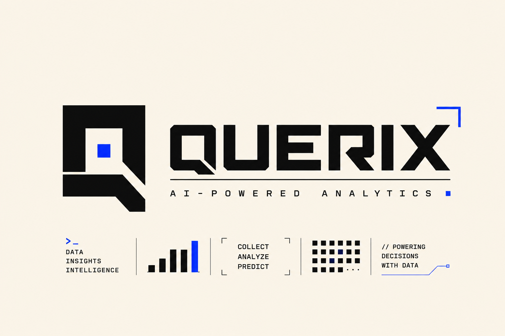
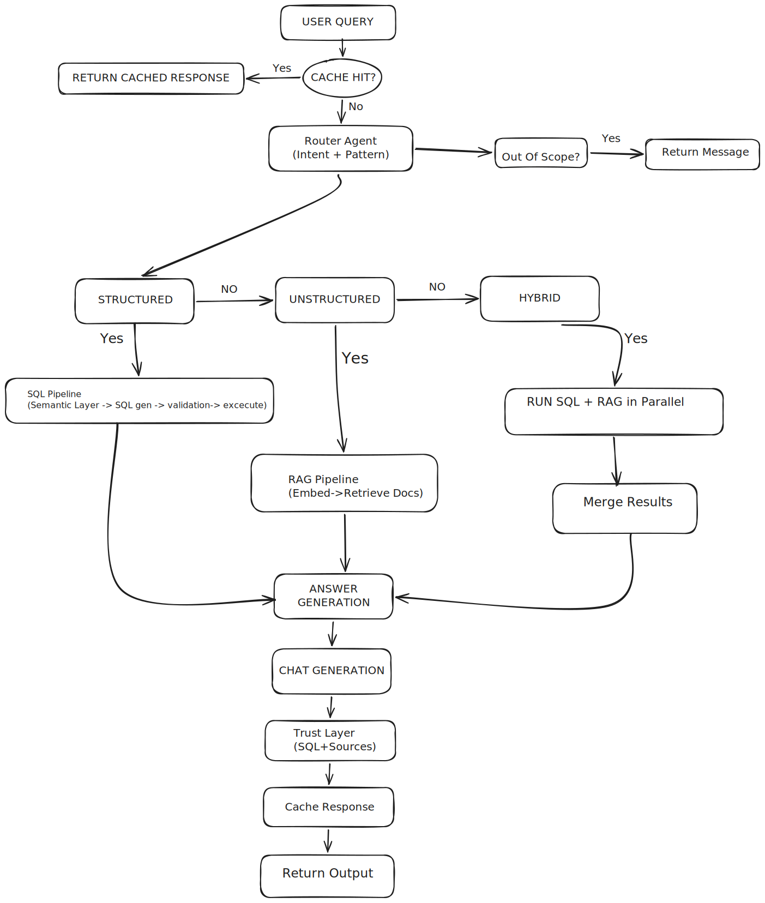
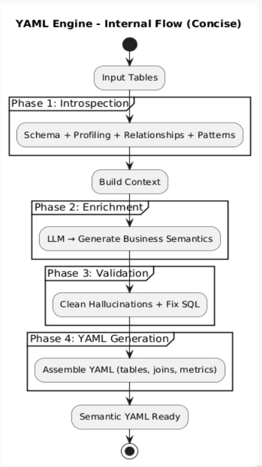

<p align="center">
  
</p>

<p align="center">
  <strong>AI-Powered Data Analytics — Ask questions, get answers.</strong>
</p>

<p align="center">
  
  
  
  
  
</p>

---

## What is Querix?

Upload any dataset (CSV, JSON, SQLite, Parquet). Ask questions in plain English. Get SQL-backed answers, interactive charts, and follow-up suggestions — all through a multi-agent AI pipeline with no framework dependencies.

---

## Architecture

<p align="center">
  
</p>

### Query Flow

```
User Question
  → Metadata Fast-Path (schema/overview, zero LLM)
  → Query Classifier + Semantic Cache
  → Router (intent + pattern)
  → SQL Generator (DuckDB-aware)
  → Execute → Verify → Retry if needed
  → Answer Generator → Chart Selector
  → SSE stream to frontend
```

### YAML Engine

<p align="center">
  
</p>

---

## Quick Start

### Prerequisites

- Python 3.10+, Node.js 18+, Groq API key

### Backend

```bash
python -m venv .venv && source .venv/bin/activate
pip install -r requirements.txt
cp .env.example .env   # add your GROQ_API_KEY
uvicorn api.server:app --reload --port 8000
```

### Frontend

```bash
cd frontend && npm install && npm run dev
```

Open `http://localhost:5173`

---

## Tech Stack

| Layer | Tech | Purpose |
|---|---|---|
| LLM | Groq API | Routing, SQL gen, answers |
| Embeddings | sentence-transformers | Semantic cache |
| Query Engine | DuckDB | In-memory analytics |
| Backend | FastAPI + Uvicorn | API layer |
| Frontend | React 19 + Vite + TypeScript | Chat UI |
| Charts | Recharts | Visualizations |
| State | Zustand | Client state |
| Styling | Tailwind CSS v4 | Brutalist design system |

---

## API Endpoints

| Method | Route | Purpose |
|---|---|---|
| `GET` | `/api/health` | Health check |
| `POST` | `/api/upload` | Upload dataset |
| `POST` | `/api/query/stream` | SSE query stream |
| `POST` | `/api/query` | Synchronous query |
| `POST` | `/api/session/clear` | Clear session |
| `GET` | `/api/profile` | Get user profile |
| `POST` | `/api/profile` | Save user profile |

---

## Project Structure

```
├── api/                    # FastAPI server, session, chart converter
├── app/
│   ├── agents/             # Router, SQL gen, validator, answer gen, verifier
│   ├── core/               # DuckDB, Groq client, cache, vector store, semantic profiler
│   └── utils/              # Chart selection, SQL parsing
├── frontend/
│   ├── src/
│   │   ├── components/     # UI components (dashboard, layout, charts)
│   │   ├── pages/          # Dashboard, Settings, DataWorkspace
│   │   ├── store/          # Zustand state
│   │   └── lib/            # API client, utilities
│   └── package.json
├── assets/                 # Logo, architecture diagrams
├── config/                 # Prompt templates
├── supabase/               # Supabase migrations
└── requirements.txt
```

---

## Notes

- No agent orchestration frameworks — all agent logic is explicit Python modules.
- Upload-only by design — no demo datasets, all analysis runs on user-provided data.
- Self-healing SQL with error-feedback retry and verifier-guided correction.
